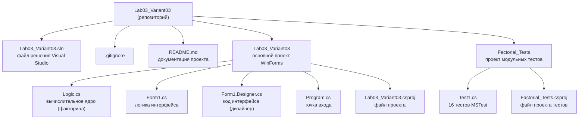

# Лабораторная работа №3: Алгоритмы и анализ сложности

Тема: Сравнительное исследование рекурсивного и итеративного вычисления факториала

Дисциплина: Алгоритмизация и программирование

Вариант: №3

---

## Об авторе

*   Студент: Воронова А.С.
*   Группа: Б.ПИН.ИИ.25.16
*   Специальность: Разработка систем искусственного интеллекта (09.03.04)

---

## Описание проекта

Данный проект представляет собой десктопное приложение на Windows Forms (C#), разработанное для сравнения двух алгоритмов вычисления факториала согласно варианту №3. Приложение измеряет время выполнения каждого алгоритма, подсчитывает количество операций и визуализирует результаты в виде таблицы и графика.

### Основные функциональные возможности:

#### **Одиночное вычисление** 
*   Ввод числа n от 1 до 20
*   Вычисление n! рекурсивным и итеративным методом
*   Отображение результата, времени выполнения и количества операций для каждого метода
*   Измерение времени с помощью класса `Stopwatch`

#### **Экспериментальное исследование** 
*   Автоматический запуск обоих алгоритмов для всех n от 1 до 20
*   Усреднение результатов по 1000 запускам для точности измерений
*   Таблица сравнения времени и количества операций
*   График зависимости времени выполнения от n (GDI+)

#### **Алгоритмы** 
*   **Рекурсивный:** `n! = n × (n-1)!`, базовый случай `0! = 1`
*   **Итеративный:** цикл от 2 до n с накоплением произведения
*   Теоретическая сложность обоих: `O(n)` по времени
*   Рекурсивный: `O(n)` по памяти, итеративный: `O(1)` по памяти

---

## Технологический стек

*   Язык программирования: C#
*   Платформа: .NET 8.0
*   Тип приложения: Windows Forms (WinForms)
*   Графическая библиотека: System.Drawing (GDI+)
*   Измерение времени: System.Diagnostics.Stopwatch
*   Тестирование: MSTest 4.0.1
*   Среда разработки: Visual Studio 2026

---

## Структура репозитория

После клонирования вы увидите следующую структуру файлов и папок:

---

## Запуск проекта

### Клонирование репозитория

```bash
git clone https://github.com/fisaxili/Lab03_Variant03.git
cd Lab03_Variant03
```

### Запуск приложения

```bash
cd Lab03_Variant03
dotnet run
```

Альтернативный способ — открыть файл решения в Visual Studio 2026 и нажать F5.

### Запуск тестов

```bash
cd Factorial_Tests
dotnet test
```
